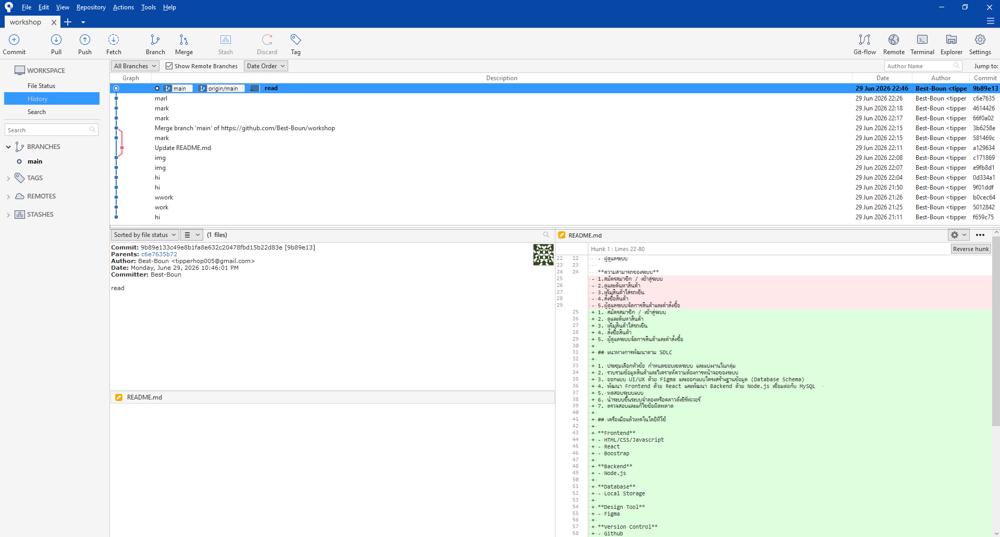

# E-Commerce Platform for Computer Hardware and Gaming Gears

**สมาชิก**
- สุรวุฒิ บุญยู้
- เชษฐกิตติ์ สืบสุขสันติ
- รัชภูมิ ธรรมประชา
- ภูริภัทร ทองมวน

## หลักการและเหตุผล

- ปัจจุบันความต้องการอุปกรณ์คอมพิวเตอร์และเกมมิ่งเกียร์เติบโตขึ้นอย่างมาก แต่ผู้ซื้อมักเจอปัญหาร้านค้าออนไลน์ที่ใช้งานยากและจัดหมวดหมู่ซับซ้อน คณะผู้จัดทำจึงพัฒนาระบบ    E-commerce นี้ขึ้น เพื่อสร้างแพลตฟอร์มจำลองที่ซื้อขายง่าย ค้นหาสินค้าได้สะดวก และแยกหมวดหมู่อุปกรณ์ชัดเจน เพื่อตอบโจทย์พฤติกรรมของผู้บริโภคยุคดิจิทัลได้อย่างมีประสิทธิภาพ

## วัตถุประสงค์ของโครงงาน

- เพื่อพัฒนาเว็บแอปพลิเคชัน E-commerce สำหรับซื้อขายอุปกรณ์คอมพิวเตอร์ที่ค้นหาง่ายและแยกหมวดหมู่ชัดเจน
- เพื่อพัฒนาระบบตะกร้าสินค้าที่สามารถคำนวณเงิน ปรับเพิ่ม/ลดจำนวน และสรุปยอดสั่งซื้อได้อย่างถูกต้อง

## ขอบเขตของระบบ

**ผู้ใช้งาน**
- ลูกค้า
- ผู้ดูแลระบบ
- ผู้จัดการ

**ความสามารถของระบบ**
1. สมัครสมาชิก / เข้าสู่ระบบ
2. ดูและค้นหาสินค้า
3. เพิ่มสินค้าใส่รถเข็น
4. สั่งซื้อสินค้า
5. ผู้ดูแลระบบจัดการสินค้าและคำสั่งซื้อ

## แนวทางการพัฒนาตาม SDLC

1. ประชุมเลือกหัวข้อ กำหนดขอบเขตระบบ และแบ่งงานในกลุ่ม
2. รวบรวมข้อมูลสินค้าและวิเคราะห์ความต้องการหน้าจอของระบบ
3. ออกแบบ UI/UX ด้วย Figma และออกแบบโครงสร้างฐานข้อมูล (Database Schema)
4. พัฒนา Frontend ด้วย React และพัฒนา Backend ด้วย Node.js เชื่อมต่อกับ MySQL
5. ทดสอบระบบแบบ
6. นำระบบขึ้นระบบจำลองหรือคลาวด์เซิร์ฟเวอร์
7. ตรวจสอบและแก้ไขข้อผิดพลาด

## เครื่องมือแล้วเทคโนโลยีที่ใช้

**Frontend**
- HTML/CSS/Javascript
- React
- Boostrap

**Backend**
- Node.js

**Database**
- Local Storage

**Design Tool**
- Figma

**Version Control**
- Github

## แนวทางในการทดสอบระบบ

**ประเภทการทดสอบ**
- User Acceptance Testing (UAT)

**เครื่องมือที่ใช้**
- Manual Testing

## ผลลัพท์ที่คาดว่าจะได้รับ

1. ระบบสามารถแสดงรายการสินค้าและราคาอุปกรณ์คอมพิวเตอร์แยกตามหมวดหมู่ได้อย่างถูกต้อง
2. ระบบสามารถบันทึก ปรับปรุง และคำนวณราคาสินค้าในตะกร้าของลูกค้าได้แบบเรียลไทม์
3. ระบบสามารถจำลองการออกใบสรุปยอดเงินและประวัติการสั่งซื้อหลังสิ้นสุดขั้นตอนชำระเงิน
4. ข้อมูลการเลือกซื้อสินค้าถูกจัดเก็บใน Local Storage ได้อย่างถูกต้องและปลอดภัยฝั่งผู้ใช้

## แผนการดำเนินงาน

1. เก็บรวบรวมความต้องการของระบบ, ออกแบบ UI/UX ด้วย Figma และออกแบบโครงสร้างฐานข้อมูล (Database Schema)น Local Storage ได้อย่างถูกต้องและปลอดภัยฝั่งผู้ใช้
2. เขียนโค้ดส่วนหน้าบ้านด้วย React เพื่อสร้างหน้าจอแสดงสินค้า หมวดหมู่ ตะกร้าสินค้า และหน้าจำลองสั่งซื้อ
3. พัฒนาส่วนหลังบ้านด้วย Node.js และสร้างฐานข้อมูล MySQL เพื่อใช้จัดการและเชื่อมต่อข้อมูลสินค้าและคำสั่งซื้อ
4. ทำการทดสอบระบบแบบ Manual Testing และทำ UAT ตรวจสอบความถูกต้อง พร้อมจัดทำสรุปเพื่อนำเสนอผลงาน

## Screenshot SourceTree 




## System Architecture

```mermaid
flowchart TB

%% =========================
%% CUSTOMER
%% =========================
subgraph CUSTOMER["👤 CUSTOMER"]
direction LR
A[Register / Login]
B[Home]
C[Browse Products]
D[Product Details]
E[Shopping Cart]
F[Checkout]
G[Payment]
H[Order Complete]
I[Order History]

A --> B --> C --> D --> E --> F --> G --> H --> I
end

%% =========================
%% ADMIN
%% =========================
subgraph ADMIN["🛠️ ADMINISTRATOR"]
direction TB

AA[Admin Login]
AB[Dashboard]

AA --> AB

AB --> AC[Manage Products]
AB --> AD[Manage Categories]
AB --> AE[Manage Orders]
AB --> AF[Manage Users]

end

%% =========================
%% BACKEND
%% =========================
subgraph BACKEND["⚙️ BACKEND (Node.js)"]
direction LR

BA[Authentication]
BB[Product Service]
BC[Cart Service]
BD[Order Service]
BE[User Service]
BF[Admin Service]
BG[REST API]

end

%% =========================
%% DATABASE
%% =========================
subgraph DATABASE["🗄️ DATABASE / STORAGE"]
direction LR

DA[(Users)]
DB[(Categories)]
DC[(Products)]
DD[(Cart)]
DE[(Orders)]
DF[(Order Items)]
DG[(Payments)]

end

%% =========================
%% CONNECTIONS
%% =========================

CUSTOMER --> BACKEND
ADMIN --> BACKEND

BA --> DA
BB --> DB
BB --> DC
BC --> DD
BD --> DE
BD --> DF
BD --> DG
BE --> DA
BF --> DA
